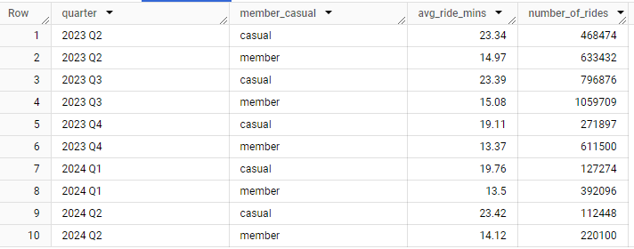
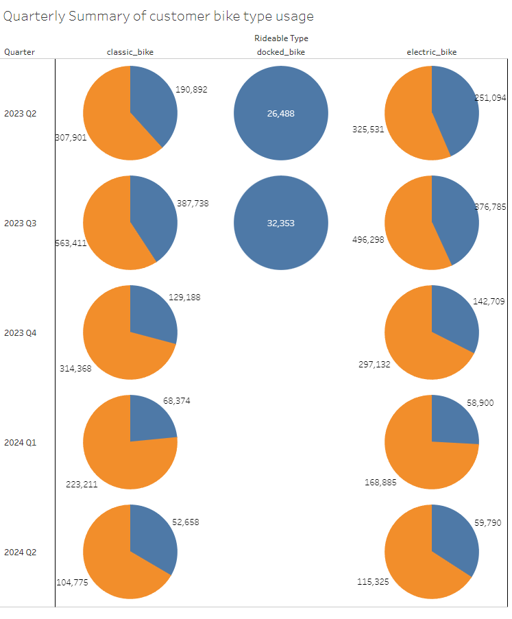

#Case Study: Cyclist \(A Google Data Analytics Professional Certificate Capstone Project\)

*Hello and welcome! This is my capstone project for Google's Data Analytics Professional Certificate on Coursera. For this capstone I chose to work with data provided by the course on rental bike usage.*

##Scenario

*You are a junior data analyst working on the marketing analyst team at Cyclistic, a bike-share company in Chicago. The director of marketing believes the company’s future success depends on maximizing the number of annual memberships. Therefore, your team wants to understand how casual riders and annual members use Cyclistic bikes differently. From these insights, your team will design a new marketing strategy to convert casual riders into annual members. But first, Cyclistic executives must approve your recommendations, so they must be backed up with compelling data insights and professional data visualizations.*

##Stakeholders
**Company** Cyclistics
**Report to** Lily Moreno, Director of Marketing
**Audience** Cyclistic executive team

##ASK
How do annual members and casual riders use Cyclistic bikes differently?
Provide a report with the following deliverables: 
    1. A clear statement of the business task 
    2. A description of all data sources used
    3. Documentation of any cleaning or manipulation of data
    4. A summary of your analysis
    5. Supporting visualizations and key findings
    6. Your top three recommendations based on your analysis

##Prepare
The capstone assignment provided a link to the company's ride history, found [here](https://divvy-tripdata.s3.amazonaws.com/index.html) I downloaded the data from May 2023 to April 2024.

##Process
I first opened each of the 12 speadsheets and created a column called ride_length. Then used a function to calculated the ride length by subtracting the started_at from the ended_at columns. I created a day_of_week column and populated the rows by using the WEEKDAY function. 
I then cleaned the data by removing duplicates and unnecessary columns. 
The remaining columns are as listed:
    +rideable_type
    +started_at
    +ended_at
    +member_casual
    +ride_length
    +day_of_week
After calculating the ride length, I noticed I was getting an error for some rows due to the started_at and ended_at data was transposed. To correct this, I sorted the ride_length column so it grouped all of the '\#\#\#' results. This enabled me to quickly correct the data by selecting the range and drag the cells to the desired column while holding shift.
I then uploaded the files into BigQuery where I cleaned the data further with the following queries.

```sql
/*Recreating the table to reorder the columns. I noticed with the initial table if set the day_of_week column as an integer, which would cause an issue with a future query so I created this table so it would cast the column as a string instead.*/
create table `monthly_bike_usage.edited_bike_use_table` AS 
SELECT  
  member_casual,
  rideable_type,
  started_at,
  ended_at,
  ride_length,
  CAST(day_of_week AS STRING) AS day_of_week,
  
FROM 
  `tribal-thought-424101-q7.monthly_bike_usage.raw_bike_use_table`
;

/* For an easier read, I opted to change the day_of_week column to display the names of the days. */

UPDATE
  `monthly_bike_usage.NEW_final_bike_use_table`
SET
  day_of_week =
    CASE
      WHEN day_of_week = '1' THEN 'Sunay'
      WHEN day_of_week = '2' THEN 'Monday'
      WHEN day_of_week = '3' THEN 'Tuesday'
      WHEN day_of_week = '4' Then 'Wednesday'
      WHEN day_of_week = '5' THEN 'Thursday'
      WHEN day_of_week = '6' THEN 'Friday'
      WHEN day_of_week = '7' THEN 'Saturday'
    END
Where day_of_week IN ('1','2','3','4','5','6','7')
;

/* To make analyzing simpler I opted to create a month column and extracted the month from the started_at column*/

update  
  `monthly_bike_usage.edited_bike_use_table` 
SET 
  month = EXTRACT(MONTH FROM started_at)
WHERE
  started_at IS NOT NULL;

/* This created the column as an integer so I recreated the table with the column as a string so I could change the numbers into words. */

create or replace table `monthly_bike_usage.edited_bike_use_table`
AS
SELECT
  member_casual,
  rideable_type,
  started_at,
  ended_at,
  ride_length,
  day_of_week,
  CAST(month AS STRING) AS month

FROM 
  `tribal-thought-424101-q7.monthly_bike_usage.edited_bike_use_table`
  ;

/* Changing month numbers into words */

UPDATE 
  `monthly_bike_usage.edited_bike_use_table`

SET
  month=
    CASE
      when month = '1' THEN 'January'
      when month = '2' THEN 'February'
      when month = '3' THEN 'March'
      when month = '4' THEN 'April'
      when month = '5' THEN 'May'
      when month = '6' THEN 'June'
      when month = '7' THEN 'July'
      when month = '8' THEN 'August'
      when month = '9' THEN 'September'
      when month = '10'THEN 'October'
      when month = '11'THEN 'November'
      when month = '12'THEN 'December'
    END
WHERE
  month IN ('1','2','3','4','5','6','7','8','9','10','11','12')
  ;

/*I then decided to add a quarter column so it could be used in the analysis. */

UPDATE
  `monthly_bike_usage.edited_bike_use_table`
SET
  quarter = 
    CASE
      WHEN 
        month = 'May' 
        OR 
        month = 'June' 
      THEN '2023 Q2'

      WHEN 
        month = 'July' 
        OR 
        month = 'August' 
        OR 
        month = 'September' 
      THEN '2023 Q3'

      WHEN 
        month = 'October'
        OR 
        month ='November'
        OR 
        month='December' 
      THEN '2023 Q4'

      WHEN 
        month= 'January'
        OR
        month= 'February'
        OR
        month= 'March'
      THEN '2024 Q1'

      WHEN
        month= 'April'
      THEN '2024 Q2'
    END
  WHERE month IN ('May','June','July','August','September','October','November','December','January','February','March','April')
  ;

/*Next I created the final table I intend to use for analysis. At this time, I also realized that the time stamp format of the ride_length column could cause some confusion so I opted to create a ride_minutes column instead by using the TIMESTAMP_DIFF statement. */

create or replace table `monthly_bike_usage.final_bike_use_table` AS 
SELECT  
  member_casual,
  rideable_type,
  started_at,
  ended_at,
  TIMESTAMP_DIFF(ended_at,started_at, minute) AS ride_minutes,
  day_of_week,
  month,
  quarter,
  
FROM 
  `tribal-thought-424101-q7.monthly_bike_usage.edited_bike_use_table`
;

/* After considering some of the ridetimes on the final table, I decided to filter the table further. I recreated the table while filtering out any ride times that were 5 minutes or less and times that were more than 720 (12 hours) minutes. These entries were likely either mistakes or maintenance check outs and they will skew my results. */

create or replace table `monthly_bike_usage.final_bike_use_table` AS 
SELECT  
  member_casual,
  rideable_type,
  started_at,
  ended_at,
  ride_minutes,
  day_of_week,
  month,
  quarter,
  
FROM 
  `tribal-thought-424101-q7.monthly_bike_usage.final_bike_use_table`

WHERE ride_minutes >= 5 AND ride_minutes < 720;

```

##Analyze

First, I wanted to get a summary of the ride distribution between the two types of customers. I ran the following query to find that members \(62.14\) used the service roughtly 25% more than casual customers \(37.86\).

```SQL
with cte_total as (
  select 
    count(member_casual) as total_rides,

  from `tribal-thought-424101-q7.monthly_bike_usage.final_bike_use_table`
)
SELECT
  member_casual,
  round(cast((count(member_casual)/cte_total.total_rides)*100 AS Float64),2) AS ride_percentage,
  count(member_Casual) as count_of_rides
FROM
  `tribal-thought-424101-q7.monthly_bike_usage.final_bike_use_table`,cte_total
Group BY
  member_casual,
  cte_total.total_rides
```

I then broke down the ride lengths and number of rides between each customer type for each quater. On average, casual customers took longer rides than members each quarter. Members with an avagerage of 14.21 minute and casual customers with 21.80 minutes. However, members used the service more frequently each quarter. I also noticed that there is a dip in ride times between each customer in 2024 Q1, which is expected due to the colder months. It appears the longest rides are taken during the summer and early fall months of Q3. 



I used the following query to pull this.

```SQL
SELECT 
  quarter,
  member_casual,
  round(avg(ride_minutes),2) AS avg_ride_mins,
  count(member_casual) AS number_of_rides,
 FROM `tribal-thought-424101-q7.monthly_bike_usage.final_bike_use_table`
 GROUP BY
  quarter,
  member_casual
  ORDER BY
    quarter,
    member_casual
```
I also created a breakdown of which type of bike was being used by which customer type each quarter. I then imported the results into Tableau Public to create this visualization.



I used the following query to pull the data.

```SQL
SELECT 
  quarter,
  member_casual,
  rideable_type,
  count(member_casual) AS number_of_rides,
 FROM `tribal-thought-424101-q7.monthly_bike_usage.final_bike_use_table`
 GROUP BY
  quarter,
  member_casual,
  rideable_type
  ORDER BY
    quarter,
    member_casual,
    rideable_type
```
